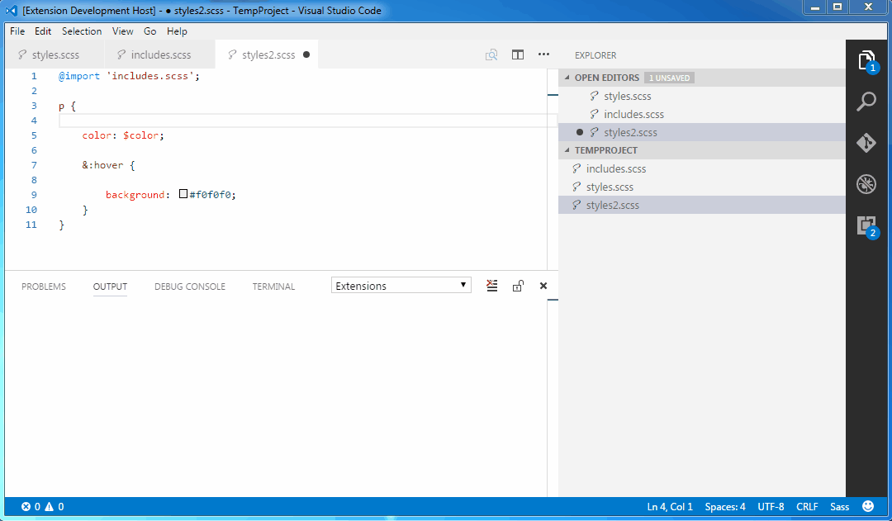

# EasySass README

It's about time someone created a standalone extension to compile SASS/SCSS files in Visual Studio Code. Don't you think?

## Features

Automatically compiles SASS/SCSS files to .css and .min.css upon saving. You may also quickly compile all SCSS/SASS files in your project.

## Commands

* `Compile all SCSS/SASS files in the project` - compiles all sass and scss files in selected folder

## Extension Settings

This extension contributes the following settings:

* `easysass.compileAfterSave`: enable or disable automatic compilation after saving
* `easysass.generateExpanded`: generate expanded, human-readable CSS file (file.scss -> file.css)
* `easysass.generateMinified`: generate minified CSS file (file.scss -> file.min.css)
* `easysass.excludeRegex`: exclude files from compilation with regular expression

## Release Notes

### 0.0.4

You may now define target folder for generated CSS files. Also, target formats and extension (for instance, .min.css) are also configurable.

**Enjoy!**